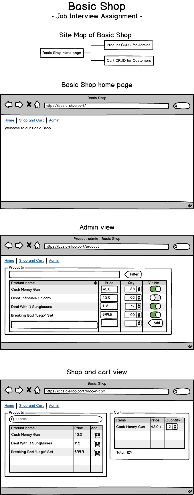
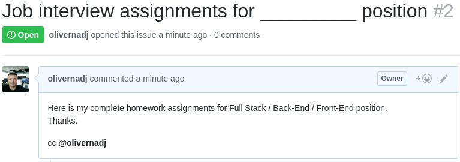

# Job Interview Assignments for Full Stack, Back-End and Front-End Developer position

## Introduction
The task is to create a Basic Shop web application with 3 pages: Welcome, Product [CRUD][CRUD] and Shopping Cart CRUD.

We have only one task, but with options for Full Stack, Back-End and Front-End.
A Front-End developer may use localStorage and focus on the user interface, meanwhile a Back-End developer may done with RESTful-API endpoint only. Naturally a Full Stack folk should be able to progress on both side.

The reason why I combined the task for all stack is because the feature request usually does not care about the affinity of the developers, but the comprehensive product.

As we practice I highly recommend to follow the [MVP][MVP] development technique and push your prototype as soon as it has any working function.

Are you ready?

## Mockup
The following mockup can give you a hint, what todo.

## The Task
Build a Basic Shop web application with 3 pages.
 - **Basic Shop home page** is a static welcome page with links to the admin and customer pages.
 - **Admin view** is a CRUD interface where admins (or anyone who click on that link) can creat, list, modify products.
 - **Shop and cart view** is a CRUD interface for Shopping Cart plus it list only visible products.

### Back-End must have
 - Build a working web application on Java, Spring Boot, Mybatis and MySQL
 - Endpoints to manage products
 - Endpoints to manage cart
 - A README.md telling how it works.

### Back-End should have
 - Clear project structure and readable code style
 - Provide MySQL migration files
 - Usages of Docker or a cloud platform
 - Demonstration of TDD practices
 - Comment or Documentation in clear English for Front-End developer as SLA

### Front-End must have
 - Build a Single-page Application website using React Redux
 - Back-End can be mocked using [Json-Server][Json-Server]
 - A view to manage products.
 - A view to manage cart.
 - A README.md telling how it works.

### Front-End should have
 - View separation with Router
 - Good demonstration of state management
 - Clear project structure and readable code style
 - Demonstration usage of Babel and LESS/SASS/SCSS
 - Clear demonstration of stateless and stateful components
 - Comment or Documentation in clear English for Back-End developer as SLA

### Front-End bonus
 - Utilization of [Ant Design][AntDesign] or any of the resources listed [HERE][awesome]
 - Utilization of [Alibaba DvaJS][DvaJS]
 - Unit testing (Jest + Enzyme)
 - Usage of best practices such as BEM, DRY

### Full Stack must have
 - All the must have of Front- and Back-End

### Full Stack should have
 - All the should have of Front- and Back-End

## Submit the assignment
Once you've completed, push your commitment to Github. Because your submissions occur on Github follow a particular format which includes a clearly documented README.

Finally raise an issue as detailed below.

Submit your project by creating an issue on your repository and adding the Github handle (@olivernadj) to the issue body so we can review the submission.

Also be sure to include a README.md telling how it works.

## Please contact me if you have any question.
Oliver Nadj
Staff Software Engineer | Lazada Techhub, Vietnam | www.alibabagroup.com
oliver.nadj@alibaba-inc.com | +841229880451 | DingTalk: olivernadj |  Skype: nosk83

[MVP]:<https://en.wikipedia.org/wiki/Minimum_viable_product>
[CRUD]:<https://en.wikipedia.org/wiki/Create,_read,_update_and_delete>
[Json-Server]:<https://github.com/typicode/json-server>
[AntDesign]:<https://ant.design/>
[awesome]:<https://github.com/alexpate/awesome-design-systems>
[DvaJS]:<https://github.com/dvajs/dva>
