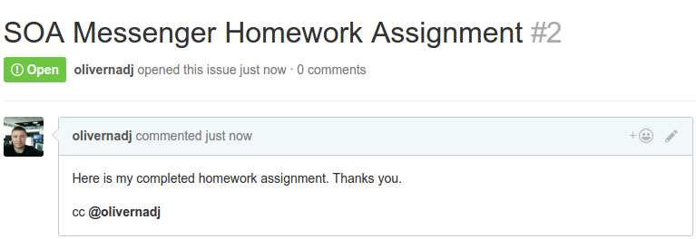

# Job Interview Assignments for DevOps, Monitoring Engineer position

## About the assignment 
The prework is try to be as simple as possible, but it combines many different technologies, basically it is a micro-service architecture .
Most probably many part of the prework you've never done before and you have to figure it out. Yeah, we would like to "see" how you deal with technical challenges, dig into it or give up.

The prework has some strict HOWTO restriction, but many times UPTOYOU. Just like in normal working circumstances in our office. Again keep the things as simple as possible, but done.

Are you ready?

## TODO
Create a micro-services architecture for sending a simple message through many services. Somehow like this:
```
[https call] -> [receiver web app] > [message broker] > [talkative web app] -> [browser]
```

### Before you start
Please make sure you have an up to date Docker engine. All the application or service you will set up or create, you need to do it on Linux compatible Docker containers.

### The message receiver and forwarder application
Set up a web server with self signed ssl certificate. On top of this server write and run a web application (any language/technique you prefer) what listen on standard https port and receive only one post parameter namely `text`. Example for a call: 
```
curl -k --data "text=for-bar" https://receiverapp:443/
[the message transmitted to message queue]
```
When the application receive the POST request in `text` parameter, it should create a message and send to a message broker.

### Message broker
Choose message broker as you wish.

Configure and expose the message broker to be able to listen from `[receiver web app]` and able to delivery to `[talkative web app]`.

### The talkative web application
The application should present the message in a simple web page on the standard http port. The html page should listen on websocket and immediately change the message when a new message arrive.

### Run
Provide a bash script what builds/starts the project.

### Architecture restriction
Organize each services and application into separate container. 
Eg.:
```
[web server for receiver web app]
[receiver web app]
[message broker]
[web server for talkative web app]
[talkative web app]
```


## Submit the assignment
Once you’ve completed, push your commitment to Github. Because your submissions occur on Github follow a particular format which includes a clearly documented README.

Finally raise an issue as detailed below.



Submit your project by creating an issue on your repository and adding the Github handle (@olivernadj) to the issue body so we can review the submission.

Also be sure to include a README.md telling how it works.

## Please contact me if you have any question.

Oliver Nadj  
Staff Software Engineer | Lazada Techhub, Vietnam | www.alibabagroup.com  
oliver.nadj@alibaba-inc.com | +84 1229880451 |  Skype: nosk83  

