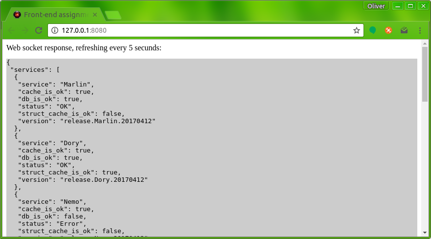
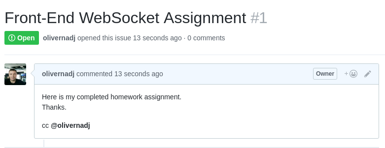

# Job Interview Assignment for Sr. Front-End Developer position

## About the assignment
As we are looking for a [Sr. Front-End Developer with strong API and WebSocket understanding](https://www.lazada.com/career-description/?id=37807). Therefore the test requires some back-end understanding - run a server like application - and of course create a front-end presentation for a **Microservice Architecture** based on websocket stream. 
You also need to be familiar with version controlling. 

The pre-work has some strict HOWTO restriction, but many times UPTOYOU. Just like in normal working circumstances in our office. keep the things as simple as possible, but done.

Are you ready?

## TODO
 - Install the environment and dependencies
 - Clone and run the application
 - **Create a front-end presentation for a given websocket stream.**
 - Submit the assignment

### Install the environment and dependencies
The application is written in golang. You can find installation guides here [https://golang.org/doc/install] or I can recommend this one for [Ubuntu][Ubuntu].
```sh
go get github.com/gorilla/websocket
go install github.com/gorilla/websocket
```

### Clone the application.
Please do not fork the repository as it could help/mislead other candidates. So better to just remove the origin.

```sh
~$ git clone https://github.com/olivernadj/assignments.git
~$ cd assignments
assignments$ git remote -v
origin  https://github.com/olivernadj/assignments.git (fetch)
origin  https://github.com/olivernadj/assignments.git (push)
assignments$ git remote rm origin
assignments$ git remote -v
```

### Run
```
assignments$ cd front-end-2017
frint-end-2017$ go run ws.go
```
You can open your web browser and check [http://127.0.0.1:8080]
The result must be something like this:


In this scenario, the json stram contains service status and service connectivity status in a microservice architecture. 


### Create a front-end presentation for a given websocket stream
Basically the main part of the test.
Use your imagination, experience or google it how could you create a view for service map what is dynamically changing based on the json in WebSocket.
The application initially just print the json from WebSocket, but you need to figure out, how to build a nice and informative front end layer on it (GUI), for presenting current service map and status.

Service map view must indicate:
 - the health status of the service
 - the resource status of the services
 - the connection between services and the activity of the connection

Service map view should:
 - Easy to extend. New services and connection often changes
 - The implementation should be as simple as possible.
 - Ergonomic, easy to understand.


### Submit the assignment
Once you’ve completed, push your commitment to Github. Because your submissions occur on Github follow a particular format which includes a clearly documented README.

Finally raise an issue as detailed below.



Submit your project by creating an issue on your repository and adding the Github handle (@olivernadj) to the issue body so we can review the submission.

Also be sure to include a README.md telling how it works.

## Please contact me if you have any question.

Oliver Nadj
Staff Software Engineer | Lazada Techhub, Vietnam | www.alibabagroup.com
oliver.nadj@alibaba-inc.com | +84 1229880451 |  Skype: nosk83 


[//]: # (These are reference links used in the body of this note and get stripped out when the markdown processor does its job. There is no need to format nicely because it shouldn't be seen. Thanks SO - http://stackoverflow.com/questions/4823468/store-comments-in-markdown-syntax)

  [Ubuntu]: <https://www.digitalocean.com/community/tutorials/how-to-install-go-1-6-on-ubuntu-16-04>
